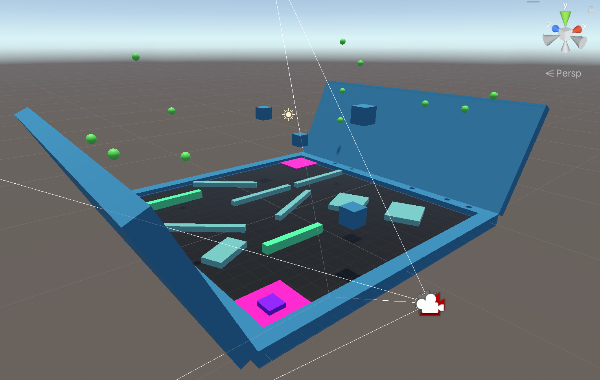

# Unity Review

This repo contains my study notes and learning projects contained in the course [Complete C# Unity Game Developer 3D](https://www.udemy.com/course/unitycourse2/)

## Projects Overview




## Unity Notes

### PlayAroundLab

- press `alt + left mouse button` to look around the scene
- press `f` to focus on an object / a group of objects
- use `Command + D` to make a quick copy of the game object
- drag the game object to Assets to create its Prefabs
- use `Q`(View), `W`(Move), `E`(Rotate), `R`(Scale), `T`(Rect), `Y`(Transform) to switch the functionality of the cursor

### ObstacleGame

- ```
  public class Mover : MonoBehaviour
  {
      // Start is called before the first frame update
      void Start()
      {
        transform.Translate(1, 0, 0); // the object would only move once
      }

      // Update is called once per frame
      void Update()
      {
          transform.Translate(0.01f, 0f, 0f); // the object would keep moving along x axis
      }
  }
  ```

- transform

  - `transform.Translate(xValue, yValue, zValue);`
  - `transform.Rotate(xAngle, yAngle, zAngle);`

- `[SerializeField] float x = 0.1f;` => could edit the x field more easily in Unity Editor
- ```
  float xValue = Input.GetAxis("Horizontal");  // (old Input System) could use xValue/yValue to do transform
  float yValue = Input.GetAxis("Vertical");
  ```
- `Time.deltaTime` => frame rate independent
- use Cinemachine to follow an object
  1. Install Cinimachine from Package Manager
  2. Add Cinimachine Brain component to camera
  3. Add Virtual Camera and rename
  4. Point the Virtual Camera to follow the player (set Body->Framing Transposer, set Follow->target object)
  5. Tune distance
- Basic Collision
  1. check the Box Collider component option for items that need to handle collision
  2. add Rigidbody component to Player object
  3. add some constraints on position/rotation to the rigid body of player object
  - OnCollisionEnter() callback method would be called every time the attached object gets hit
    ```
    public class ObjectHit : MonoBehaviour
    {
        private void OnCollisionEnter(Collision other)
        {
            Debug.Log("Bumped into a wall");
        }
    }
    ```
    (attach ObjectHit script to the Wall object)
- GetComponent<>() method => get/set the wanted components

  ```
  GetComponent<MeshRenderer>().material.color = Color.black;  // return type => MeshRenderer
  GetComponent<MeshRenderer>().enabled = false; // make the attached game Object disappear
  GetComponent<Rigidbody>.useGravity = false; // disable the gravity functionality
  GetComponent<Rigidbody>.AddRelativeForce(Vector3.up * mainThrust * Time.deltaTime); // add a force to the attaching object
  ```

- Time.time => get the time elapsed from the starting of the game to current frame

- tag

  ```
  private void OnCollisionEnter(Collision other)
  {
      if (other.gameObject.tag == "Player")
      {
          // Debug.Log("Bumped into a wall");
          GetComponent<MeshRenderer>().material.color = Color.black;
          this.gameObject.tag = "Hit";
      }
  }
  ```

### ProjectBoost

- we could ajust gravity, which identified as a Vector3 in unity, in Project Settings -Physics -Gravity.

- Audio

  - add Audio Listener component to the Main Camera
  - add Audio Source component to an object
  - attach an audio source file as the Audio Clip of the Audio Source

- Control Audio
  `AudioSource audioSource = GetComponent<AudioSource>();`

  - check if the audio is playing: `audioSource.isPlaying; // a true/false property`
  - play the sound: `audioSource.Play();`
  - stop the sound: `audioSource.Stop();`

- Unity SceneManagement

  - File -Build Settings -Add scenes to Scenes In Build
  - use SceneManagement to respawn the game

    - `using UnityEngine.SceneManagement;`
    -

    ```
      int currentSceneIndex = SceneManager.GetActiveScene().buildIndex;
      SceneManager.LoadScene(currentSceneIndex);
    ```
